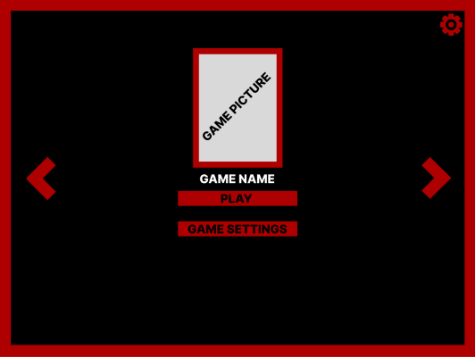

# Functional specification | Maxime CARON
|               |                           |
| ------------- | ------------------------- |
| Document name | Functional specifications |
| Document owner | Maxime CARON |
| Creation date | October 30, 2023 |
| Last update | November 14, 2023 |

Table of content

- [Functional specification | Maxime CARON](#functional-specification--maxime-caron)
  - [Context](#context)
  - [Project scope](#project-scope)
    - [Resources](#resources)
      - [Linux kernel](#linux-kernel)
      - [VirtualBox](#virtualbox)
  - [Personas and use cases](#personas-and-use-cases)
    - [Target audience](#target-audience)
    - [1. retro-gaming fan - Tony](#1-retro-gaming-fan---tony)
    - [2. Looking to recycle his old computer - Bruce](#2-looking-to-recycle-his-old-computer---bruce)
    - [3. DIY enthusiast - Clint](#3-diy-enthusiast---clint)
  - [Functional requirements](#functional-requirements)
    - [Architecture](#architecture)
    - [Control](#control)
    - [User interface](#user-interface)
    - [Installation](#installation)
    - [Update System](#update-system)
  - [Period planning](#period-planning)
  - [Success Criteria](#success-criteria)
    - [Hardware](#hardware)
    - [Installation](#installation-1)
    - [Control and user interface](#control-and-user-interface)
    - [Bugs](#bugs)
    - [Game Launcher](#game-launcher)
  - [Non-functional criteria](#non-functional-criteria)
  - [Out of scope](#out-of-scope)
  - [Security](#security)
    - [Personal Data](#personal-data)
    - [Update](#update)
  - [Risks and assumptions](#risks-and-assumptions)
  - [Glossary](#glossary)

## Context

As a student at ALGOSUP, I have the privilege and responsibility of designing and implementing an ambitious project called "Moonshot". As part of this initiative, I have chosen to carry out a proof of concept: the development of a kernel in X86 architecture dedicated to the recycling of computers equipped with Intel processors. This initiative is part of our commitment to innovation and sustainability, aimed at extending the life of existing IT equipment.

## Project scope

The main aim of this project is to demonstrate that by developing a sufficiently light kernel, adapted to computers equipped with Intel processors dating from the early 2000s, it is possible to give a new lease of life to these technologically outdated devices. The vision is to turn them into arcade machines, offering an innovative alternative to obsolescence.

This kernel acts as an interface for launching retro games coded in C language. Users can create their own games, adding a participatory dimension to the platform. In short, the kernel functions as a retro game launcher, offering a playful and creative experience for the user community.

### Resources

#### Linux kernel

The use of the Linux kernel, which is free and accessible, is a valuable resource for the project. By using it as a reference, we save time by avoiding the development of already existing functionalities.

#### VirtualBox

VirtualBox, a virtualization software, plays an essential role. It enables us to create virtual machines to test the kernel on various computer configurations, thus ensuring a thorough evaluation of its compatibility and performance.

## Personas and use cases

### Target audience

This kernel is aimed at a diverse audience, from retro-gaming enthusiasts to DIY enthusiasts. The following personas represent our presumed target audience.

### 1. retro-gaming fan - Tony

- Objectives:
  - Tony, a retro-gaming enthusiast, wants to play retro games on a dedicated computer without too much expense.
  - He aspires to recapture the nostalgia of arcade machines by having access to several games in one place.
- Challenges:
  - Create an affordable computer dedicated to retro-gaming, compatible with easily accessible hardware.
  - Meet the exacting expectations of a retro-gaming enthusiast like Tony.
  
### 2. Looking to recycle his old computer - Bruce

- Objectives:
  - Eco-conscious Bruce wants to give his 10-year-old computer a new lease on life.
  - Bruce knows a bit about computers, but he's not a specialist. He'd like to make the transition as simple as possible.
- Challenges:
  - Ensure that the kernel requires few resources to run on a 10-year-old computer.
  - Simplify installation and configuration for non-specialist users like Bruce.

### 3. DIY enthusiast - Clint

- Objectives:
  - Clint is a DIY enthusiast with ambitions to build his own arcade machine.
  - With some computer knowledge, he wants to create and add his own retro games to the terminal.
- Challenges:
  - Ensure kernel compatibility with arcade joysticks and buttons for an authentic experience.
  - Offer users the possibility of creating, adding and exchanging games via an update system, accompanied by full documentation.

## Functional requirements

### Architecture

- The kernel must be compatible with Intel processors.
- No graphics card is required for kernel operation.
- Compatibility with 32-bit Intel processors.
- Kernel development in C language and X86 assembler.

### Control

- Kernel control via keyboard.
- Integration of kernel control with joystick and buttons, similar to an arcade machine.

### User interface

- The kernel should have a simple, intuitive user interface.
- The kernel's user interface should be visually reminiscent of an arcade machine.

### Installation

- Possibility of installing the kernel on a hard disk.
- Alternative kernel installation via USB key.
- Simplification and documentation of the entire kernel installation process.

### Update System

- Kernel update possible via USB key.
- Clear documentation and simplicity of the kernel update procedure.

## Period planning

This section presents the planning of the main periods of the project, from the research phase to the final presentation of the project.

| Start date | End date   | Week(s) | Event |
| ---------- | ---------- | ------- | ----- |
| 11/13/2023 | 12/03/2023 | 1 - 3   | Project presentation |
| 12/04/2023 | 12/24/2023 | 4 - 6   | Research and planning. |
| 12/25/2023 | 01/28/2024 | 7 - 11  | Basic kernel development. |
| 01/29/2024 | 02/25/2024 | 12 - 15 | Development of compatibility with arcade joysticks and buttons. |
| 02/26/2024 | 03/24/2024 | 16 - 19 | User interface development. |
| 03/25/2024 | 05/05/2024 | 20 - 25 | Kernel update system development. |
| 05/06/2024 | 06/09/2024 | 26 - 30 | System development for creating and adding games to the kernel. |
| 06/10/2024 | 08/25/2024 | 31 - 41 | Kernel correction and optimization. |
| 08/08/2024 | 09/08/2024 | 42 - 43 | Preparation for first test phase. |
| 09/09/2024 | 11/17/2024 | 44 - 53 | First phase of testing by key users. |
| 11/18/2024 | 12/15/2024 | 54 - 57 | Correction according to user feedback. |
| 12/16/2024 | 01/05/2025 | 58 - 60 | Preparation for first test phase. |
| 01/06/2025 | 03/16/2025 | 61 - 70 | Second phase of testing by key users. |
| 03/17/2025 | 04/13/2025 | 71 - 74 | Correction according to user feedback. |
| 04/14/2025 | -          | 75 -    | Final presentation of the project |

## Success Criteria

### Hardware

- The kernel must be guaranteed to run on computers equipped with an Intel Pentium 3 Katmai processor and later.
- A minimum configuration of 512 MB RAM is required to ensure kernel performance.

### Installation

- The kernel must be installed on a hard disk with a minimum capacity of 20 GB.
- It must be possible to install the kernel from a USB key.
- The installation process should be straightforward, require a measured execution time, and be accompanied by full documentation.

### Control and user interface

- The kernel must offer a fluid control experience through the use of a keyboard.
- An alternative is provided for control using a joystick and buttons, emulating the characteristic interaction of an arcade machine.
- The kernel's user interface must be both simple and intuitive, making it easy to navigate and use.
- The kernel interface should look like this:

### Bugs

- No significant bugs should be present, excluding behaviors such as :
  - Unexpected and unexplained kernel shutdown.
  - Complete system freeze.
  - Loss of data.
  - Loss of system control.
- Minor anomalies, such as incorrect display of the user interface, games or controls, are not tolerated.

### Game Launcher

- The kernel must be able to launch retro C-coded games in accordance with the documentation provided.

## Non-functional criteria

- The kernel's resource consumption must not exceed 80% of the resources available on a computer equipped with an Intel Pentium 3 Katmai processor and 512 MB of in-game RAM, to prevent premature wear and tear on the computer.
- Kernel startup time should be less than 2 minutes to ensure a responsive user experience from launch.
- The kernel's response time, when executing common tasks, must be kept below 1 second to guarantee a fluid experience.
- The kernel update process should be completed in less than 15 minutes, ensuring efficient system maintenance.
- Kernel installation time should not exceed 15 minutes to ensure a fast and efficient user experience.

## Out of scope

- Installation of the kernel on a hard disk of less than 10 GB is not supported, to guarantee the minimum space required for games and prevent any future limitation of available space.
- Installing the kernel on a computer equipped with an AMD processor is not an option for this project. The kernel, developed in X86 assembler, cannot be adapted for compatibility with AMD processors due to time constraints.
- Internet connectivity is not integrated into the kernel. This decision is motivated by security concerns, aimed at minimizing potential risks associated with online system vulnerability.

 
## Security

### Personal Data

- To ensure total security, the kernel neither requests nor retains any personal information from the user.
- The kernel does not include Internet connection functionality, eliminating any risk of remote hacking.

### Update

- The kernel can only be updated from an official source, previously communicated to users. This guarantees the integrity and security of updates.
- No kernel updates can be performed remotely, minimizing the potential risks associated with remote intrusions. Users will be notified transparently, and official announcements will be available at the designated update location.

## Risks and assumptions

| Risk | Impact | Probability | Preventive Measures | Action Plan |
| ---- | ------ | ----------- | ------------------- | ----------- |
| Resource problems | Non-functioning on some computers | High | Resource-optimized development. Limit functionality and visual effects. Kernel development must take into account the resources required, possible optimizations and the limitation of functionalities. | Kernel development must take into account the resources required, possible optimizations and functionality limitations.  |
| Technical issues | Bugs, unexpected restarts, display faults | Medium | Preliminary tests before full phase. The kernel must go through several test phases to prove itself and avoid as many bugs as possible. | The kernel must go through several test phases to be tested and avoid as many bugs. |
| Game issues | Variable quality of games created by users | Medium | Exhaustive documentation to create quality games. Transparent communication with the community. Documentation must enable users to create quality games. | The documentation must enable users to create quality games. |
| Problems with game creation | Complexity of game creation | Low | Simple, documented game creation system. Active user support. | The game creation system must be simple, documented and actively supported. |

## Glossary

| Term | Definition |
| ---- | ---------- |
| ALGOSUP | ALGOSUP is a computer school located in Vierzon, France. It offers 3 to 5 year courses in computer science. |
| AMD  | AMD (Advanced Micro Devices) is an American company specializing in the manufacture of processors, graphics cards and other computer components. |
| Arcade machine | An arcade machine is a public video game device, often equipped with a screen, buttons and a joystick, enabling players to play arcade games. |
| Bug | A bug is a defect or error in a computer program that causes undesired behavior. |
| C language | The C language is a high-level programming language that has been widely used in software development. It is known for its flexibility and proximity to machine language. |
| DIY | Do It Yourself refers to the practice of creating, making or repairing something yourself, rather than buying ready-made products. |
| Go | "Go" is the abbreviation for gigabyte, a unit of measurement for storage capacity or memory, equivalent to 1,024 megabytes. |
| Graphics card | A graphics card is a computer component that manages the display of images on the screen. It is essential for graphics quality and game performance. |
| HDD | A hard disk is a magnetic data storage device used in computers to store files, programs and the operating system. |
| Intel | Intel is an American company specializing in the manufacture of processors and electronic components. It is best known for its processors, which are used in many computers. |
| Joysticks | Joysticks are video game control devices that allow users to move a cursor or character on the screen by pushing it in different directions. |
| Kernel | The kernel is the central part of an operating system. It manages hardware resources and memory, and facilitates interaction between hardware and software. |
| Linux | Linux is an open source operating system based on the Linux kernel. It is widely used in the computing world, offering a free and flexible alternative to other operating systems. |
| Mo | Mo is the abbreviation for megabyte, a unit of measurement of storage capacity or memory, equivalent to 1,024 kilobytes. |
| Pentium 3 Katmai | The Pentium 3 Katmai is a specific version of the Pentium 3 processor manufactured by Intel, popular in the late 1990s. |
| RAM | RAM (Random Access Memory) is a volatile memory used by a computer to temporarily store data and running programs. It allows rapid access to information by the processor. |
| Retro-gaming | Retro-gaming refers to the practice of playing classic video games, often from older consoles, to relive gaming experiences of the past. |
| USB flash drive | A USB flash drive is a small portable storage device that uses flash memory to store data. It is often used to transfer files between computers. |
| VirtualBox | VirtualBox is an open-source virtualization software program that lets you create virtual machines on a host system, allowing multiple operating systems to run simultaneously. |
| Virtualization | Virtualization is a technology that enables the creation of virtual versions of a computing environment, such as virtual machines, allowing multiple operating systems to run on a single physical machine. |
| X86 architecture | X86 architecture The X86 architecture is a processor architecture developed by Intel. It is used in many personal computers. |
| X86 assembly language | X86 assembly language is a low-level programming language specific to the x86 processor architecture. It is used to write programs that can be directly understood by the processor. |

