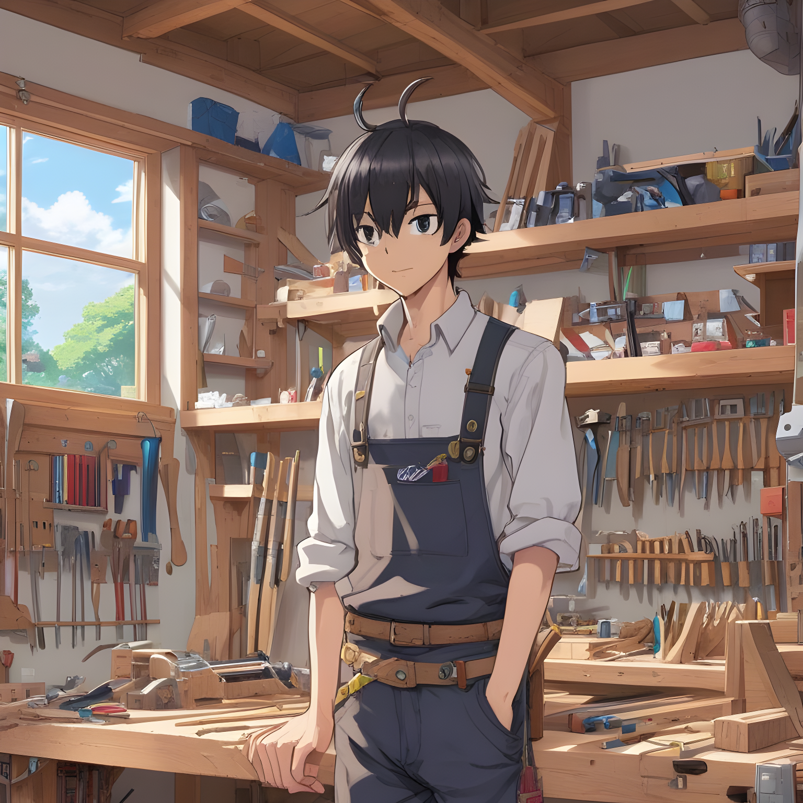

# Moonshot Functional Specification | Maxime CARON
|               |                           |
| ------------- | ------------------------- |
| Document name | Functional specifications |
| Document owner | Maxime CARON |
| Creation date | October 30, 2023 |
| Last update | November 28, 2023 |

Table of Content

- [Moonshot Functional Specification | Maxime CARON](#moonshot-functional-specification--maxime-caron)
  - [Context](#context)
  - [Project Scope](#project-scope)
    - [Overview](#overview)
    - [Retro-Gaming and Computer Recycling Nowadays](#retro-gaming-and-computer-recycling-nowadays)
    - [Resources](#resources)
  - [Audience](#audience)
    - [Targeted Audience](#targeted-audience)
    - [Personas](#personas)
  - [Functional Requirements](#functional-requirements)
    - [Architecture](#architecture)
    - [User Experience](#user-experience)
    - [User Interface](#user-interface)
    - [Installation](#installation)
    - [Update System](#update-system)
    - [Game Creation](#game-creation)
  - [Budget](#budget)
    - [Budget Constraints](#budget-constraints)
    - [Analysis of the French Second-Hand Market](#analysis-of-the-french-second-hand-market)
    - [Average Price For The Project](#average-price-for-the-project)
  - [Period Planning](#period-planning)
  - [Success Criteria](#success-criteria)
    - [Hardware](#hardware)
    - [Installation](#installation-1)
    - [User Experience And Interface](#user-experience-and-interface)
    - [Bugs](#bugs)
    - [Game Launcher](#game-launcher)
  - [Non-Functional Criteria](#non-functional-criteria)
  - [Out Of Scope](#out-of-scope)
  - [Security](#security)
    - [Personal Data](#personal-data)
    - [Update](#update)
  - [Risks And Assumptions](#risks-and-assumptions)
  - [Glossary](#glossary)

## Context

As a student at ALGOSUP, I have the privilege and responsibility of designing and implementing an ambitious project called "Moonshot". As part of this initiative, I have chosen to carry out a proof of concept: the development of a kernel in X86 architecture dedicated to the recycling of computers equipped with Intel processors. This initiative is part of our commitment to innovation and sustainability, aimed at extending the life of existing IT equipment.

## Project Scope

### Overview
The main aim of this project is to demonstrate that by developing a sufficiently light kernel, adapted to computers equipped with Intel processors dating from the early 2000s, it is possible to give a new lease of life to these technologically outdated devices. The vision is to turn them into arcade cabinets, offering an innovative alternative to obsolescence.

This kernel acts as an interface for launching retro games coded in C language. Users can create their own games, adding a participatory dimension to the platform. In short, the kernel functions as a retro game launcher, offering a playful and creative experience for the user community.

### Retro-Gaming and Computer Recycling Nowadays
**Retro-Gaming**:  
In a [study conducted by ExpressVPN](https://www.expressvpn.com/fr/blog/qui-consacre-le-plus-de-temps-aux-jeux-video-ce-nest-pas-la-generation-z/) to investigate the type of people and the amount of time they spend playing video games. We can see that out of 2000 people, 79% still play old video games.
The interesting detail of the study is the part where they explain that of the 79% who play old video games, only 38% do so out of nostalgia.
This means that retro-gaming is an interesting market not only for nostalgic gamers but also, as the study explains, for people of Generation Z who are attracted by old games with less elaborate graphics but varied gameplay.

**Computer Recycling Nowadays**:  
In 2023, the website [The World Count](https://www.theworldcounts.com/stories/electronic-waste-facts) counted over 45 million tons of electronic waste thrown away worldwide.

In France, as the following [European study](https://www.europarl.europa.eu/news/en/headlines/society/20201208STO93325/e-waste-in-the-eu-facts-and-figures-infographic) shows, only 36.6% of electronic waste was recycled in 2017. Recycling is not without cost, and what's more, not every computer can be fully recycled; there's always some waste that can't be reused. This is easy to understand when you consider that a computer contains many different materials, including iron, steel alloys, and different types of plastic and glass.

**Computer lifespan:**  
To estimate the lifespan of a computer, it's necessary to understand why people change computers.

On its website, [Microsoft](https://www.microsoft.com/en-us/windows/learning-center/reasons-to-get-new-computer) explains the 3 reasons to consider when deciding whether to change your computer. They recommend changing because of the computer's power, the battery, or simply because it's not too expensive. Based on these criteria, various studies and articles indicate that the average lifespan of a computer is between 3 and 5 years.  
Data used :
- [Texas Department of Information Resources - PC Life Cycles](https://dir.texas.gov/sites/default/files/2022-05/PC%20Life%20Cycles%20-%20Guidelines%20for%20Establishing%20Life%20Cycles.pdf)
- [HP - What is the Average Lifespan of a Computer?](https://www.hp.com/in-en/shop/tech-takes/post/average-computer-lifespan)
- [Satistas - Desktop PC replacement cycle length in the United States from 2022 to 2027](https://www.statista.com/statistics/267465/average-desktop-pc-lifespan/)

### Resources

**Linux kernel:**  
The use of the Linux kernel, which is free and accessible, is a valuable resource for the project. By using it as a reference, we save time by avoiding the development of already existing functionalities.

**VirtualBox:**  
VirtualBox, a virtualization software, plays an essential role. It enables us to create virtual machines to test the kernel on various computer configurations, thus ensuring a thorough evaluation of its compatibility and performance.

## Audience

### Targeted Audience

The target audience can be very broad, but the main targets are as follows:
- Retro game fans
- Retro game developers
- DIY enthusiasts
- People who care about the environment and recycling

### Personas

The following personas are designed to best represent each target audience:

1. **Looking To Recycle His Old Computer - Bruce**
   | Name | Description |
   | ---- | ----------- |
   |  | Bruce is 47 years old, he is a father and is very involved in the ecological cause.   He recycles as best he can and likes to give a second life to his old devices.   Bruce doesn't know anything about computers. |

   | Behaviors | Needs |
   | --------- | ----- |
   | Bruce recently had to change his computer and he would like to give new life to his old computer that he had for 15 years.   He would like to transform it into a games console for himself and his children. |- A very resource-efficient system to run on an old computer.   - A simple system to install and maintain. |
  
   Challenges:
    - Ensure that the kernel requires few resources to run on a 15 year old computer.
    - Simplify installation and configuration for non-specialist users like Bruce.
  
2. **DIY enthusiast - Clint**
   | Name | Description |
   | ---- | ----------- |
   |  | Clint is 25, works part-time and spends all his spare time repairing old objects or creating new ones.  He's quite comfortable with computers. |

   | Behaviors | Needs |
   | --------- | ----- |
   | For some time now, Clint has wanted to create his own arcade cabinet.  He's very good at carpentry and feels capable of doing the case, but he's never installed an operating system. | - A system adapted to old computers.   - A simple system to install and maintain.  - A system compatible with classic arcade cabinet equipment such as joysticks and buttons. |

    Challenges:
      - Create a simple, intuitive and well-documented installation system.
      - Create a system compatible with joysticks and buttons.
      - Create a system that can be easily maintained by a non-specialist like Clint.
  
3. **Retro-Gaming Fan - Tony**
   | Name | Description |
   | ---- | ----------- |
   |  | Tony is a 19 year old student who loves retro games. Like many students, he doesn't have much money. Tony knows a bit about computers, but he's not an expert. |
   
   | Behaviors | Needs |
    | --------- | ----- |
   | Tony wants to rediscover the nostalgia of his old games, but also discover new and original ones.  As a student, he'd like to be able to separate his work computer from the computer he plays on.  | - A computer dedicated to video games but not too expensive.   - To play original retro games.   - A system that faithfully simulates the sensations experienced with old consoles and arcade cabinets. |
  
    Challenges:
      - Create an affordable computer dedicated to retrogaming, compatible with easily  accessible hardware.
      - Meet the exacting expectations of a retrogaming enthusiast like Tony.

4. **Retro-Game developer - Steve**
   | Name | Description |
   | ---- | ----------- |
   |  | Steve is 35 years old and works as a network administrator in a company.   He lives simply and enjoys coding video games in his spare time.  | 
   
   | Behaviors | Needs |
   | --------- | ----- |
   | Steve is currently creating retro video games and would like to test them in an immersive environment.  Once his games are finished, Steve likes to share them for free to get feedback on his work. | - A test environment very similar to that of retro games.   - The ability to share games with others. |
  
    Challenges:
      - Create a documentation dedicated to the creation of kernel games.
      - Create a simple, intuitive and well-documented game import system.
      - Give visibility to project contributors like Steve.
      - Create an immersive, retro-gaming environment.

## Functional Requirements

### Architecture

- The kernel must be compatible with Intel processors.
- No graphics card is required for kernel operation.
- Compatibility with 32-bit Intel processors.
- Kernel development in C language and X86 assembly.

### User Experience
**Devices:**
| Device | Description | Connection |
| ------ | ----------- | ---------- |
| Keyboard | The user must be able to interact with the kernel using a keyboard for basic interactions. It interacts with the keyboard arrows as well as the “enter” key. | USB, PS/2 |
| Joystick and buttons | The user must be able to interact with the core using a joystick with 4 degrees of freedom, as well as 6 buttons similar to those of an arcade cabinet in order to guarantee optimal immersion.| USB |

**Using the main interface:**  

When the user starts the kernel for classic use, he arrives at the main interface, it is from this interface that we access the different games but also the game parameters and the kernel parameters.
Using this interface is intended to be simple and intuitive.  
Below is a diagram of the interface:

| Schema | Description |
| ------ | ----------- |
|  | 1. Picture of the game   2. Game name   3. Button to launch the game   4. Button to access the game settings   5. Buttons to shift and even play on the left   6. Buttons to shift and even play on the right   7. Button to access the kernel settings |

The movement of the games when the user clicks on one of the right or left arrows can be schematized as follows:
| Schema | Description |
| ------ | ----------- |
|  | When the user clicks on the red arrow (5 in the previous schema),  the position of the games shifts by 1 to the right so game 1 is displayed.  In the same way, if the user clicks on the green arrow (6 in the previous schema),  the position of the games shifts by 1 to the left so game 8 is displayed. |

Navigating from one game to another is done either using the keyboard arrows or the "enter" key or with the joystick and buttons.  
The different user inputs and the resulting actions are detailed in the following table:

| Input | Action |
| ----- | ------ |
| Keyboard arrows left or right | Move the selection from one game to another. |
| Keyboard arrrow up or down | Change the selection between the following actions: access game settings, start the game or access kernel settings. |
| Keyboard enter | Validate the selection. |
| Joystick left or right | Move the selection from one game to another. |
| Joystick up or down | Change the selection between the following actions: access game settings, start the game or access kernel settings. |
| Button 1 to 6 | Validate the selection. |

### User Interface
The design of the main interface is initially simple because it is not one of the major issues.
The main interface is designed to be simple and intuitive, it is not intended to be a work of art but rather a functional interface.  
The kernel interface should look like this:

### Installation

- Possibility of installing the kernel on a hard disk.
- Possibility of choosing the installation location.
- Kernel installation done via USB key or CD-ROM.
- Simplification and documentation of the entire kernel installation process.

### Update System

The update system must not only install a new kernel version, but also allow the user to install games.

**Kernel update:**  

The steps involved in updating the kernel should be straightforward, to enable a user unfamiliar with the world of computing to carry out an update.
The steps involved in an update are as follows:
- Download the update file on the official project GitHub.
- Put the file on a USB key and insert USB key into computer.
- From the main kernel interface, go to setting.
- Select "Update system".

**Game installation:**  

Installing games is very similar to updating the system.
The steps involved in installing a game are as follows:
- Download the game file on the official project GitHub.
- Put the file on a USB key and insert USB key into computer.
- From the main kernel interface, go to setting.
- Select "Update system".

### Game Creation
Game creation must be accessible to as many users as possible, but using a language that is sufficiently low-level to meet the limitations imposed by the hardware.
The tools given to users for this task are as follows:
- A C library with documentation explaining how to use it.
- Documentation explaining how to create a game with step-by-step instructions.
- Full, detailed documentation of kernel operation.
- A virtual machine configuration to emulate a kernel.

The game creations have the following requirements:
- The game must be created in C following the C99 standard.
- The code must only run on 32 bits and a single thread.
-  The game must require less than 512 MB of RAM.

## Budget

### Budget Constraints
The interest of this project is that it makes it possible to recycle old computers and give them a new life but in order to function it must meet a certain budgetary constraint. So the budget limit set for materials is €100.  
With this amount it should be possible to carry out the project and have a functional system.

### Analysis of the French Second-Hand Market

- **Computer** budget was determined through the following steps: An investigation for a "desktop computer" was conducted on the second-hand website [Leboncoin](https://www.leboncoin.fr/), with a maximum price set at 50€. The first 10 computers featuring an Intel microprocessor were then selected. The average price of these 10 computers became the reference price used to establish the budget.

  As a result, the average price of a computer used to calculate the budget is 30 euros. Note that the price has been rounded off, as most of the time, prices on [Leboncoin](https://www.leboncoin.fr/) are rounded off. 

- **Screen** budget is calculated using a similar approach was taken: A search for a "screen" was performed on the second-hand website [Leboncoin](https://www.leboncoin.fr/), with a maximum price limit set at 30€. The first 10 screens identified were then selected, and the average price of these screens became the reference price used in budget determination.

  As a result, the average price of a screen used to define the budget is 15€. Note that the price has been rounded, as most of the time, prices on [Leboncoin](https://www.leboncoin.fr/) are rounded off.

- **Keyboard** budget was set as follows: A search for a "keyboard" was executed on the second-hand website [Leboncoin](https://www.leboncoin.fr/), with a maximum price limit set at 20€. The first 10 keyboards meeting the criteria were selected, and the average price of these keyboards became the reference price used to define the budget.

  Hence, the average price of a keyboard used in budget calculation is 4€. Note that the price has been rounded, as most of the time, prices on [Leboncoin](https://www.leboncoin.fr/) are rounded off.

For more details, please refer to this [document](https://docs.google.com/spreadsheets/d/111yPxzFDjgGrgsK3DC9IpWPv7YG_TXEbQ3DORjWvqSk/edit?usp=sharing).

- **Joystick and buttons**: the second-hand market for these items has proven to be a real challenge. Therefore, following the  [recommendations](https://www.thegeekpub.com/278188/the-best-arcade-joystick-and-buttons) of "The geek pub arcade" site, we opted for a specific pack available at this [link](https://www.amazon.com/dp/B01M2X88QP/ref=sspa_dk_detail_3?psc=1&pd_rd_i=B01M2X88QP&pd_rd_w=MTBGG&content-id=amzn1.sym.386c274b-4bfe-4421-9052-a1a56db557ab&pf_rd_p=386c274b-4bfe-4421-9052-a1a56db557ab&pf_rd_r=76KQXVS8VCWWTJ7G3NVE&pd_rd_wg=opBVU&pd_rd_r=f1a9e54a-1684-43e0-b3e4-a144986e3938&s=toys-and-games&sp_csd=d2lkZ2V0TmFtZT1zcF9kZXRhaWxfdGhlbWF0aWM&smid=A3H7VB6FZ4M9FM&spLa=ZW5jcnlwdGVkUXVhbGlmaWVyPUEzMEQxREFBNDVFUjJMJmVuY3J5cHRlZElkPUEwOTYzMDA4MzdVSks2RldWNk41TSZlbmNyeXB0ZWRBZElkPUEwNDU1MzU5T1BLVjU3RkNLNE1XJndpZGdldE5hbWU9c3BfZGV0YWlsX3RoZW1hdGljJmFjdGlvbj1jbGlja1JlZGlyZWN0JmRvTm90TG9nQ2xpY2s9dHJ1ZQ==).

  This pack, priced at 24.24€, includes 1 joystick and 10 buttons with the required features for our project.

### Average Price For The Project
As defined, the kernel and its games must be compatible with both joysticks and keyboards. This requirement enables a user to complete the project for an average of :
- 49€ for a computer, screen and keyboard.
- 69.24€ for a computer, screen, joystick and 10 buttons.
  
Both prices are low enough to make the project accessible to a large number of people and correspond to the budget limit set.

## Period Planning

This section presents the planning of the main periods of the project, from the research phase to the final presentation of the project.

| Start date | End date   | Week(s) | Event |
| ---------- | ---------- | ------- | ----- |
| 11/13/2023 | 12/03/2023 | 1 - 3   | Project presentation |
| 12/04/2023 | 12/24/2023 | 4 - 6   | Research and planning. |
| 12/25/2023 | 01/28/2024 | 7 - 11  | Basic kernel development. |
| 01/29/2024 | 02/25/2024 | 12 - 15 | Development of compatibility with arcade joysticks and buttons. |
| 02/26/2024 | 03/24/2024 | 16 - 19 | User interface development. |
| 03/25/2024 | 05/05/2024 | 20 - 25 | Kernel update system development. |
| 05/06/2024 | 06/09/2024 | 26 - 30 | System development for creating and adding games to the kernel. |
| 06/10/2024 | 08/25/2024 | 31 - 41 | Kernel correction and optimization. |
| 08/08/2024 | 09/08/2024 | 42 - 43 | Preparation for first test phase. |
| 09/09/2024 | 11/17/2024 | 44 - 53 | First phase of testing by key users. |
| 11/18/2024 | 12/15/2024 | 54 - 57 | Correction according to user feedback. |
| 12/16/2024 | 01/05/2025 | 58 - 60 | Preparation for first test phase. |
| 01/06/2025 | 03/16/2025 | 61 - 70 | Second phase of testing by key users. |
| 03/17/2025 | 04/13/2025 | 71 - 74 | Correction according to user feedback. |
| 04/14/2025 | -          | 75 -    | Final presentation of the project |

## Success Criteria

### Hardware

- The kernel must be guaranteed to run on computers equipped with an Intel Pentium 3 Katmai processor and later.
- A minimum configuration of 512 MB RAM is required to ensure kernel performance.

### Installation

- The kernel must be installed on a hard disk with a minimum capacity of 20 GB.
- It must be possible to install the kernel from a USB key.
- The installation process should be straightforward, require a measured execution time, and be accompanied by full documentation.

### User Experience And Interface

- The kernel must offer a fluid control experience through the use of a keyboard.
- An alternative is provided for control using a joystick and buttons, emulating the characteristic interaction of an arcade cabinet.
- The kernel's user interface must be both simple and intuitive, making it easy to navigate and use.

### Bugs

- No significant bugs should be present, excluding behaviors such as :
  - Unexpected and unexplained kernel shutdown.
  - Complete system freeze.
  - Loss of data.
  - Loss of system control.
- Minor anomalies, such as incorrect display of the user interface, games or controls, are not tolerated.

### Game Launcher

- The kernel must be able to launch retro C-coded games in accordance with the documentation provided.

## Non-Functional Criteria

- The kernel's resource consumption must not exceed 80% of the resources available on a computer equipped with an Intel Pentium 3 Katmai processor and 512 MB of in-game RAM, to prevent premature wear and tear on the computer.
- Kernel startup time should be less than 2 minutes to ensure a responsive user experience from launch.
- The kernel's response time, when executing common tasks, must be kept below 200 milliseconds to guarantee a fluid experience.
- The kernel update process should be completed in less than 15 minutes, ensuring efficient system maintenance.
- Kernel installation time should not exceed 15 minutes to ensure a fast and efficient user experience.

## Out Of Scope

- Installation of the kernel on a hard disk of less than 10 GB is not supported, to guarantee the minimum space required for games and prevent any future limitation of available space.
- Installing the kernel on a computer equipped with an AMD processor is not an option for this project. The kernel, developed in X86 assembler, cannot be adapted for compatibility with AMD processors due to time constraints.
- Internet connectivity is not integrated into the kernel. This decision is motivated by security concerns, aimed at minimizing potential risks associated with online system vulnerability.

## Security

### Personal Data

- To ensure total security, the kernel neither requests nor retains any personal information from the user.
- The kernel does not include Internet connection functionality, eliminating any risk of remote hacking.

### Update

- The kernel can only be updated from an official source, previously communicated to users. This guarantees the integrity and security of updates.
- No kernel updates can be performed remotely, minimizing the potential risks associated with remote intrusions. Users will be notified transparently, and official announcements will be available at the designated update location.

## Risks And Assumptions

| Risk | Impact | Probability | Preventive Measures | Action Plan |
| ---- | ------ | ----------- | ------------------- | ----------- |
| Resource problems | Non-functioning on some computers | High | Resource-optimized development. Limit functionality and visual effects. Kernel development must take into account the resources required, possible optimizations and the limitation of functionalities. | Kernel development must take into account the resources required, possible optimizations and functionality limitations.  |
| Technical issues | Bugs, unexpected restarts, display faults | Medium | Preliminary tests before full phase. The kernel must go through several test phases to prove itself and avoid as many bugs as possible. | The kernel must go through several test phases to be tested and avoid as many bugs. |
| Game issues | Variable quality of games created by users | Medium | Exhaustive documentation to create quality games. Transparent communication with the community. Documentation must enable users to create quality games. | The documentation must enable users to create quality games. |
| Problems with game creation | Complexity of game creation | Low | Simple, documented game creation system. Active user support. | The game creation system must be simple, documented and actively supported. |

## Glossary

| Term | Definition | Source |
| ---- | ---------- | ------ |
| ALGOSUP | ALGOSUP is a computer school located in Vierzon, France. It offers 3 to 5 year courses in computer science. | [Link](https://www.algosup.com/) |
| AMD  | AMD (Advanced Micro Devices) is an American company specializing in the manufacture of processors, graphics cards and other computer components. | [Link](https://en.wikipedia.org/wiki/AMD) |
| Arcade cabinet | An arcade cabinet is a public video game device, often equipped with a screen, buttons and a joystick, enabling players to play arcade games. | [Link](https://en.wikipedia.org/wiki/Arcade_cabinet) |
| Bug | A bug is a defect or error in a computer program that causes undesired behavior. | [Link](https://en.wikipedia.org/wiki/Software_bug) |
| C99 | C99 is a version of the C language standardized by the ISO in 1999. | [Link](https://en.wikipedia.org/wiki/C99) |
| C language | The C language is a high-level programming language that has been widely used in software development. It is known for its flexibility and proximity to machine language. | [Link](https://en.wikipedia.org/wiki/C_(programming_language)) |
| C library | A C library is a set of functions and constants that can be used in C programs. | [Link](https://en.wikipedia.org/wiki/C_standard_library) |
| DIY | Do It Yourself refers to the practice of creating, making or repairing something yourself, rather than buying ready-made products. | [Link](https://en.wikipedia.org/wiki/Do_it_yourself) |
| ExpressVPN | ExpressVPN is a virtual private network service offered by the British Virgin Islands-based company Express VPN International Ltd. | [Link](https://en.wikipedia.org/wiki/ExpressVPN) |
| GB | "GB" is the abbreviation for gigabyte, a unit of measurement for storage capacity or memory, equivalent to 1,024 megabytes. | [Link](https://en.wikipedia.org/wiki/Gigabyte) |
| Generation Z | Generation Z is the generation of people born between 1997 and 2012. | [Link](https://en.wikipedia.org/wiki/Generation_Z) |
| Graphics card | A graphics card is a computer component that manages the display of images on the screen. It is essential for graphics quality and game performance. | [Link](https://en.wikipedia.org/wiki/Graphics_card) |
| HDD | A hard disk is a magnetic data storage device used in computers to store files, programs and the operating system. | [Link](https://en.wikipedia.org/wiki/Hard_disk_drive) |
| HP | HP (Hewlett-Packard) is an American company specializing in the manufacture of computers and printers. | [Link](https://en.wikipedia.org/wiki/Hewlett-Packard) |
| Intel | Intel is an American company specializing in the manufacture of processors and electronic components. It is best known for its processors, which are used in many computers. | [Link](https://en.wikipedia.org/wiki/Intel) |
| Joysticks | Joysticks are video game control devices that allow users to move a cursor or character on the screen by pushing it in different directions. | [Link](https://en.wikipedia.org/wiki/Joystick) |
| Kernel | The kernel is the central part of an operating system. It manages hardware resources and memory, and facilitates interaction between hardware and software. | [Link](https://en.wikipedia.org/wiki/Kernel_(operating_system)) |
| Leboncoin | Leboncoin is a French website for classified ads. It is the most visited website in France. | [Link](https://en.wikipedia.org/wiki/Leboncoin) |
| Linux | Linux is an open source operating system based on the Linux kernel. It is widely used in the computing world, offering a free and flexible alternative to other operating systems. | [Link](https://en.wikipedia.org/wiki/Linux) |
| MB | MB is the abbreviation for megabyte, a unit of measurement of storage capacity or memory, equivalent to 1,024 kilobytes. | [Link](https://en.wikipedia.org/wiki/Megabyte) |
| Microsoft | Microsoft is an American company specializing in the manufacture of software and electronic components. It is best known for its Windows operating system, which is used in many computers. | [Link](https://en.wikipedia.org/wiki/Microsoft) |
| Pentium 3 Katmai | The Pentium 3 Katmai is a specific version of the Pentium 3 processor manufactured by Intel, popular in the late 1990s. | [Link](https://en.wikipedia.org/wiki/Pentium_III) |
| RAM | RAM (Random Access Memory) is a volatile memory used by a computer to temporarily store data and running programs. It allows rapid access to information by the processor. | [Link](https://en.wikipedia.org/wiki/Random-access_memory) |
| Retrogaming | Retrogaming refers to the practice of playing classic video games, often from older consoles, to relive gaming experiences of the past. | [Link](https://en.wikipedia.org/wiki/Retrogaming) |
| Satistas | Statista is a German company specializing in market and consumer data. | [Link](https://en.wikipedia.org/wiki/Statista) |
| The geek pub arcade | The geek pub arcade is a website dedicated to the creation of arcade cabinets. | [Link](https://www.thegeekpub.com/) |
| The World Counts | The World Counts is a website that provides statistics on the environment and the impact of human activity on the planet. | [Link](https://www.theworldcounts.com/) |
| Tread | A thread is a sequence of instructions executed by a processor. A processor can execute several threads simultaneously, allowing several programs to run at the same time. | [Link](https://en.wikipedia.org/wiki/Thread_(computing)) |
| USB flash drive | A USB flash drive is a small portable storage device that uses flash memory to store data. It is often used to transfer files between computers. | [Link](https://en.wikipedia.org/wiki/USB_flash_drive) |
| VirtualBox | VirtualBox is an open-source virtualization software program that lets you create virtual machines on a host system, allowing multiple operating systems to run simultaneously. | [Link](https://en.wikipedia.org/wiki/VirtualBox) |
| Virtualization | Virtualization is a technology that enables the creation of virtual versions of a computing environment, such as virtual machines, allowing multiple operating systems to run on a single physical machine. | [Link](https://en.wikipedia.org/wiki/Virtualization) |
| X86 architecture | X86 architecture The X86 architecture is a processor architecture developed by Intel. It is used in many personal computers. | [Link](https://en.wikipedia.org/wiki/X86) |
| X86 assembly language | X86 assembly language is a low-level programming language specific to the x86 processor architecture. It is used to write programs that can be directly understood by the processor. | [Link](https://en.wikipedia.org/wiki/X86_assembly_language) |

